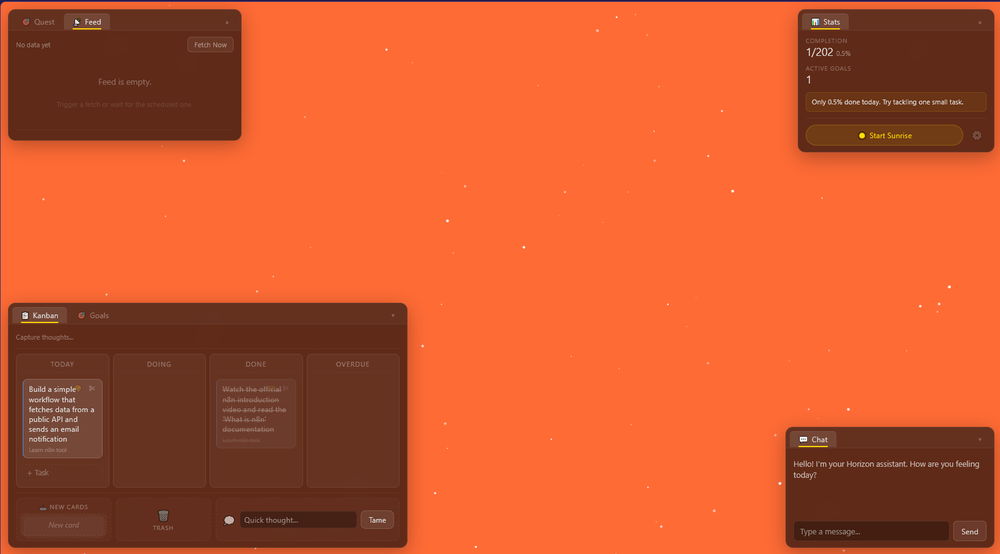

# 🌌 Horizon Chamber

[](https://www.python.org/)
[](LICENSE)
[](https://fastapi.tiangolo.com/)
[](.)

**Your ambient co-pilot for taming digital chaos and reclaiming your mornings.**

> **🏗️ MVP Notice:** This is an early MVP. Features are actively evolving, and some areas may have rough edges. Contributions and feedback are welcome!



Horizon Chamber is a single-page web app that turns your desktop into a living, breathing environment. It combines a time-aware visual nebula, a gentle sunrise alarm (manual or scheduled), and an AI-powered thought organizer that helps you capture ideas and turn them into actionable tasks.

## 🚀 Quick Start

### Option A — Browser (development)

```bash
# Install dependencies
pip install -r requirements.txt

# Copy the environment template
copy .env.example .env
# Edit .env and add your DEEPSEEK_API_KEY

# Start the server
uvicorn main:app --reload --port 8001
# Open http://localhost:8001
```

### Option B — Desktop window (recommended)

```bash
pip install -r requirements.txt
python desktop_app.py
# A native window opens — no browser tabs needed.
```

### Option C — Standalone executable (portable)

```bash
pip install -r requirements.txt
python build.py --onefile
# dist\HorizonChamber.exe  — single .exe, no Python required
```

## 🧩 Core Features

-   **Dynamic Nebula:** Colors shift from sunrise gold to deep night purple based on your system clock.
-   **Sunrise Nudge (Manual):** Click "Start Sunrise" for a 60-second audiovisual wake-up sequence (canvas fades to gold + 440→880Hz sine tone via Web Audio API).
-   **Sunrise Nudge (Auto-Schedule):** Click the ⚙️ gear icon next to the Sunrise button to set a daily auto-sunrise time. The server checks every 30s and triggers sunrise at the configured time. A localStorage fallback ensures sunrise still fires if the server is unreachable.
    -   **Note:** The schedule is stored in-memory and resets when the server restarts. The browser's localStorage backup re-applies the last known setting on page load.
-   **Capture & Sort:** A collapsible "Capture thoughts" input inside the kanban board. Paste ideas, URLs, or notes; AI classifies and injects them directly into your task workflow. Quick-capture strip at the bottom of the board for lightning-fast logging.
-   **Activity Tracking (v0.2):** The desktop app tracks which window you have focused and how long you have been idle. A small indicator in the top bar shows your current app. The right-side "Today's Focus" panel shows a live bar chart of top apps by usage time. Activity data stays local in SQLite.
    -   **Windows:** Full support via native Win32 API.
    -   **macOS/Linux:** Degraded mode — returns "unknown" (stubs ready for native implementation).
    -   **Privacy:** Tracking is OFF by default in browser mode, ON in desktop mode. Set `AUTO_START_MONITOR=false` to disable.
-   **Main Quest:** A single, editable daily intention stored in localStorage.
-   **Smart Goals & Kanban Board (v0.3):** Create long-term goals, habits, or maintenance tasks. AI auto-suggests goal types and splits tasks into subtasks. Drag-and-drop kanban with "Today", "Doing", "Done", "Overdue" columns. Progress bars, pause/archive, and auto-carry-over for unfinished tasks.
-   **AI-Powered Feed Aggregation (v0.5):** Integrates with n8n to ingest summarized content from YouTube, LessWrong, Discord, RSS, etc. Prioritized feed cards with relevance scores, categories, and dismiss/restore. Live SSE updates when new items arrive.

## 📡 API Endpoints

### Core

| Method | Path | Description |
|--------|------|-------------|
| GET | `/api/health` | Health check (reports if DeepSeek key is configured) |
| GET | `/api/time_color` | Current hex color based on server hour |
| POST | `/api/classify` | Classify text via DeepSeek, persist to DB |

### Sunrise Schedule

| Method | Path | Description |
|--------|------|-------------|
| GET | `/api/sunrise/schedule` | Current auto-sunrise schedule |
| PUT | `/api/sunrise/schedule` | Set auto-sunrise schedule `{"enabled": bool, "time": "HH:MM"}` |

### Goals & Tasks

| Method | Path | Description |
|--------|------|-------------|
| GET | `/api/goals` | List goals (`?type=long_term&archived=false`) |
| POST | `/api/goals` | Create a goal (auto-classified via AI) |
| GET | `/api/goals/{id}` | Single goal with progress analysis |
| PUT | `/api/goals/{id}` | Update goal fields |
| DELETE | `/api/goals/{id}` | Soft-delete (archive) a goal |
| GET | `/api/board` | Full kanban board state (`?date=YYYY-MM-DD`) |
| GET | `/api/board/stream` | SSE stream for real-time board updates |
| GET | `/api/today` | Today's task list in priority order |
| POST | `/api/tasks` | Create a new task for today |
| PATCH | `/api/tasks/{id}` | Update task (status, title, date) |
| POST | `/api/tasks/{id}/split` | **[AI]** Split a task into subtasks |
| POST | `/api/tasks/{id}/suggest` | **[AI]** Suggest next step for parent goal |

### Analysis & Engine

| Method | Path | Description |
|--------|------|-------------|
| GET | `/api/analysis` | Performance signals (nudges, progress) |
| GET | `/api/analysis/goal/{id}` | Per-goal analysis |
| POST | `/api/analysis/refresh` | Force re-run analysis |
| POST | `/api/engine/generate` | Manually trigger daily task generation |
| GET | `/api/engine/status` | Goal engine status |

### Activity Tracking

| Method | Path | Description |
|--------|------|-------------|
| GET | `/api/activity/now` | Currently active app/window + idle seconds |
| GET | `/api/activity/summary` | Aggregated focus summary by app (`?period=today|yesterday|last_7_days`) |
| GET | `/api/activity/stream` | SSE stream of live activity changes |
| PUT | `/api/activity/categories` | Set an app's category `{"app_name","category","label"}` |
| GET | `/api/activity/categories` | All categorized apps |
| GET | `/api/activity/history` | Recent activity log entries (`?limit=50`) |

### Feed / n8n Integration

| Method | Path | Description |
|--------|------|-------------|
| POST | `/api/feed/ingest` | **[Auth]** Receive n8n summarized feed data |
| GET | `/api/feed/items` | List feed items (`?dismissed=false&category=ai&limit=50&offset=0`) |
| GET | `/api/feed/items/{id}` | Single feed item detail |
| PATCH | `/api/feed/items/{id}/dismiss` | Dismiss a feed item |
| PATCH | `/api/feed/items/{id}/undismiss` | Restore a dismissed item |
| POST | `/api/feed/trigger` | Manually trigger n8n fetch (30-min cooldown) |
| GET | `/api/feed/stats` | Feed statistics (active/dismissed counts, last run) |
| GET | `/api/feed/stream` | SSE stream for live feed events |

## 🧪 Running Tests

```bash
pytest tests/ -v
```

The test suite covers: API endpoints, DB operations, DeepSeek client logic, scheduler, and edge cases (timeouts, missing keys, invalid input).

## 🖥️ Desktop App

The app can run as a native desktop window instead of a browser tab:

| Command | What it does |
|---|---|
| `python desktop_app.py` | Starts the FastAPI server in the background and opens a native window via **PyWebView** (Edge WebView2 on Windows, WebKit on macOS). No browser tabs, no address bar. |
| `python desktop_app.py --port 9000` | Use a custom port. |
| `python desktop_app.py --debug` | Keep the console visible with verbose logs. |

**How it works:** `desktop_app.py` spawns uvicorn in a daemon thread, waits for `/api/health` to respond, then opens a `pywebview` window pointed at `http://127.0.0.1:<port>`. When you close the window, the server shuts down gracefully.

**Single-file executable:** Run `python build.py --onefile` to produce a standalone `.exe` in `dist/` that bundles Python, the server, and the frontend into a single portable file. No Python installation needed on the target machine (though the [WebView2 Runtime](https://developer.microsoft.com/en-us/microsoft-edge/webview2/) must be present — it comes pre-installed on Windows 11 and most recent Windows 10 systems).

## 🛠️ Tech Stack

-   Python 3.9+ / FastAPI (Backend)
-   Vanilla JS + Canvas (Frontend, no CDN dependencies)
-   SQLite + aiosqlite (Database)
-   DeepSeek API (AI Classification via httpx)
-   PyWebView (Native desktop wrapper)
-   PyInstaller (Standalone executable bundler)

## 🔧 Environment Variables

| Variable | Default | Description |
|----------|---------|-------------|
| `DEEPSEEK_API_KEY` | — | DeepSeek API key (required for AI features: classification, suggestions, task splitting) |
| `DATABASE_PATH` | `./horizon.db` | Path to SQLite database file |
| `AUTO_START_MONITOR` | `false` | Start activity monitor on server boot (`true` in desktop mode) |
| `ACTIVITY_POLL_INTERVAL` | `3` | Seconds between activity checks |
| `ACTIVITY_IDLE_THRESHOLD` | `60` | Seconds idle before marking "away" |
| `ACTIVITY_PRUNE_DAYS` | `30` | Auto-delete activity logs older than N days |
| `FEATURE_ACTIVE_WINDOW` | `true` | Enable active window tracking |
| `FEATURE_IDLE_TIME` | `true` | Enable idle time tracking |
| `FEATURE_PROCESS_LIST` | `false` | Enable process tree tracking (heavier, off by default) |
| `N8N_WEBHOOK_URL` | `http://localhost:5678/webhook/...` | n8n webhook URL to trigger fetching |
| `N8N_API_KEY` | `""` | Optional API key sent to n8n webhook |
| `FEED_API_KEY` | `""` | API key to validate n8n→Horizon ingest requests |
| `FEED_POLL_INTERVAL_HOURS` | `6` | Hours between automatic scheduled fetches |
| `FEED_AUTO_FETCH` | `true` | Auto-fetch on startup if last fetch is older than interval |
| `FEED_SCHEDULER_INTERVAL` | `60` | Seconds between scheduler loop checks |
